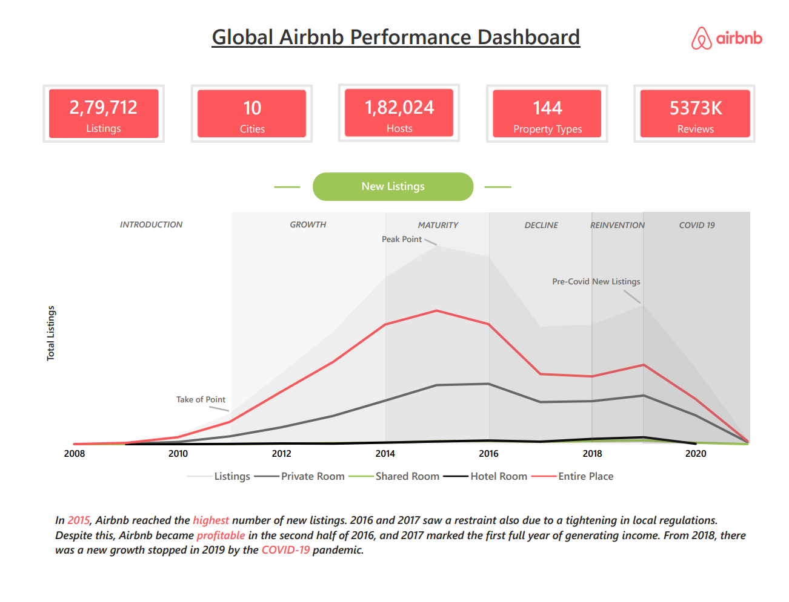
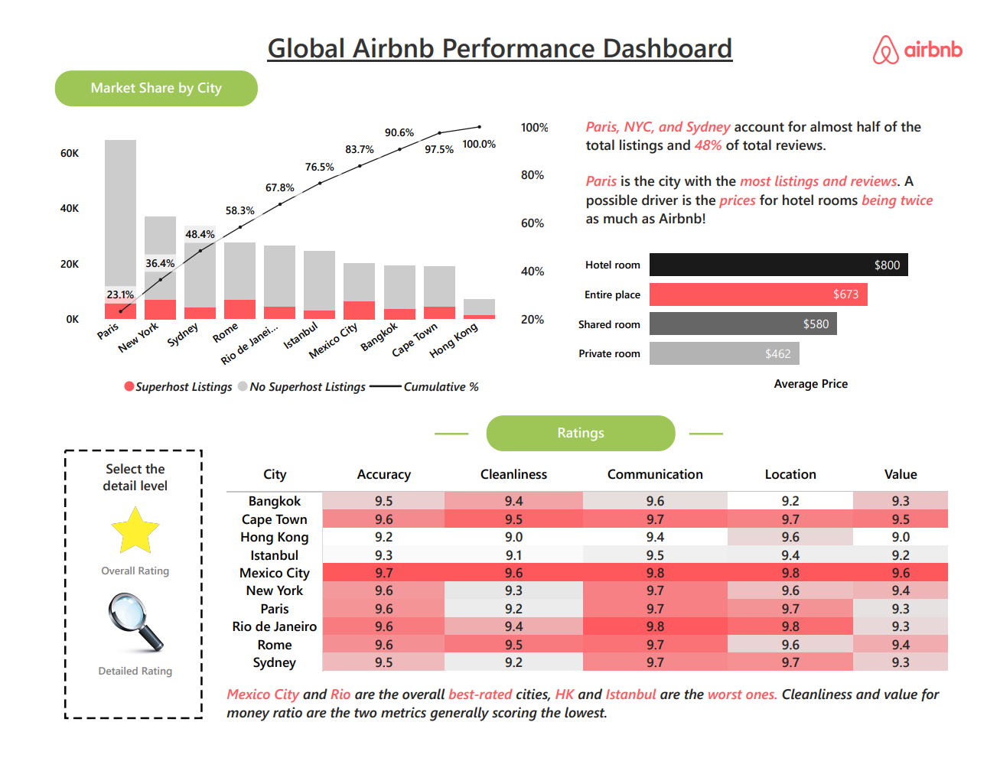
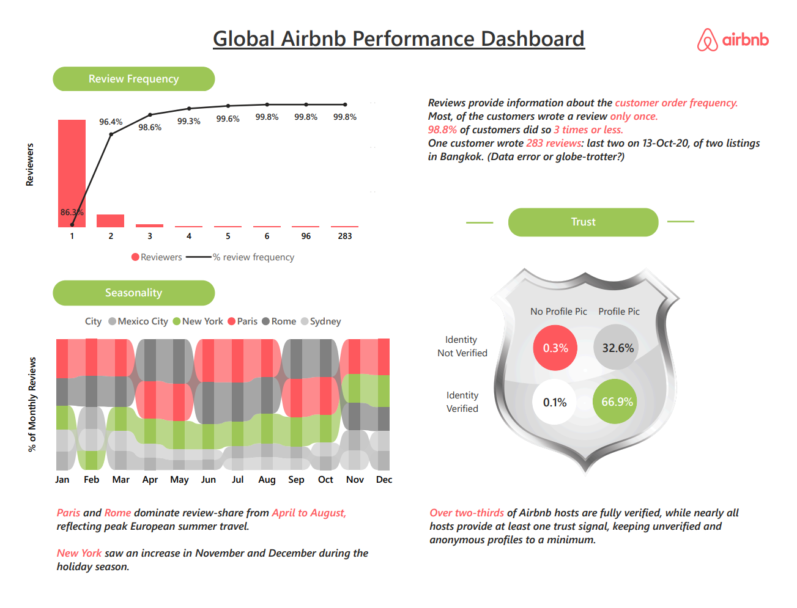

# 🏠 End-to-End Airbnb Performance Dashboard

Interactive Power BI dashboard analyzing **2,79,712 Airbnb listings**, **1,82,024 hosts**, and **5.37M reviews** across 10 global cities (2008–2020), covering market share, pricing, host trust, and review behavior.



## 📌 Project Overview

Built using the public **[Airbnb Listings & Reviews dataset](https://mavenanalytics.io/data-playground/airbnb-listings-reviews)** from Maven Analytics. The dataset arrived pre-cleaned, so the focus here was the data model, DAX layer, and dashboard/UX design.

**What this covers:**
- Modeled two source tables (`Listings`, `Reviews`) with a one-to-many relationship on `listing_id`
- Wrote **26 DAX measures** on the `Listings` table and **10 DAX measures/calculated columns** on the `Reviews` table (full list below)
- Built a 3-page report (**Overview → Ratings → Reviews**) with bookmark-driven interactivity on the Ratings page

## 🗂️ Dataset

| Table | Rows | Description |
|---|---|---|
| `Listings` | 2,79,712 | Listing details: host info, location, price, room type, review scores |
| `Reviews` | 53,73,143 | One row per review: `listing_id`, `review_id`, `reviewer_id`, `date` |

**Relationship:** `Listings[listing_id]` (1) → `Reviews[listing_id]` (*)



## 🧮 DAX Measures & Calculated Columns

### Listings table (26 measures)

| Measure | DAX | What it does |
|---|---|---|
| `Total Listings` | `COUNT(Listings[listing_id])` | Base listing count |
| `Total Hosts` | `DISTINCTCOUNT(Listings[host_id])` | Distinct host count |
| `Average Price` | `AVERAGE(Listings[price])` | Average nightly price |
| `Average Rating` | `AVERAGE(Listings[review_scores_rating])` | Average overall rating |
| `Accuracy`, `Cleanliness`, `Communication`, `Location`, `Value` | `AVERAGE(Listings[review_scores_*])` | Per-dimension average score, feeding the Ratings table |
| `Entire Place`, `Private Room`, `Hotel Room`, `Shared Room` | `CALCULATE(COUNT(Listings[listing_id]), Listings[room_type] = "...")` | Listing count by room type — used with `Average Price` for the room-type price chart |
| `Superhost Listings`, `No Superhost Listings` | `CALCULATE(COUNT(...), Listings[host_is_superhost] = "t"/"f")` | Listing count split by superhost status, stacked in the Market Share chart |
| `Verified_Profile`, `Verified_NoProfile`, `NotVerified_Profile`, `NotVerified_NoProfile` (+ `%` versions of each) | `CALCULATE([Total Hosts], host_identity_verified = ..., host_has_profile_pic = ...)` | Host count and share across all 4 combinations of identity-verified × has-profile-pic, feeding the Trust shield |
| `City Rank` | see below | Ranks cities by `Total Listings`, descending |
| `Cumulative Listings` | see below | Running total of listings up to the current city's rank |
| `Cumulative %` | `DIVIDE(Listings[Cumulative Listings], CALCULATE([Total Listings], ALL(Listings[city])))` | Cumulative % line on the Market Share Pareto chart |

### Reviews table (10 fields)

| Field | Type | DAX | What it does |
|---|---|---|---|
| `Total Reviews` | Measure | `DISTINCTCOUNT(Reviews[review_id])` | Base review count |
| `Reviewers` / `Total Reviewers` | Measure | `DISTINCTCOUNT(Reviews[reviewer_id])` | Distinct reviewer count |
| `Reviews per Reviewer` | Measure | see below | Number of reviews written by each reviewer |
| `Show in Review Frequency Chart` | Calc. column | see below | Trims the frequency histogram to `≤6` or `>85` reviews, dropping the sparse middle range |
| `Cumulative Reviewers` | Measure | see below | Running distinct-reviewer count up to the current review-frequency value |
| `Cumulative % review frequency` | Measure | `DIVIDE([Cumulative Reviewers], [Total Reviewers])` | Cumulative % line on the Review Frequency Pareto chart |
| `% of Monthly Reviews` | Measure | see below | Each month's share of reviews within the selected city context, feeding the Seasonality chart |
| `Month Number` | Calc. column | `MONTH(Reviews[date])` | Numeric month, used to sort the seasonality axis chronologically |
| `Review Month` | Calc. column | `FORMAT(Reviews[date], "MMM")` | Month name label shown on the axis |

### Highlighted formulas

```dax
City Rank =
RANKX(
    ALL(Listings[city]),
    [Total Listings],
    ,
    DESC
)

Cumulative Listings =
VAR CurrentRank =
    MAXX(VALUES(Listings[city]), [City Rank])
RETURN
CALCULATE(
    [Total Listings],
    FILTER(ALL(Listings[city]), [City Rank] <= CurrentRank)
)
```

```dax
Reviews per Reviewer =
CALCULATE(
    COUNT(Reviews[review_id]),
    ALLEXCEPT(Reviews, Reviews[reviewer_id])
)

Cumulative Reviewers =
VAR CurrentReviews =
    MAX(Reviews[Reviews per Reviewer])
RETURN
CALCULATE(
    DISTINCTCOUNT(Reviews[reviewer_id]),
    FILTER(
        ALL(Reviews[Reviews per Reviewer]),
        Reviews[Reviews per Reviewer] <= CurrentReviews
    )
)

Show in Review Frequency Chart =
IF(
    Reviews[Reviews per Reviewer] <= 6
    || Reviews[Reviews per Reviewer] > 85,
    1,
    0
)
```

```dax
% of Monthly Reviews =
DIVIDE(
    [Total Reviews],
    CALCULATE([Total Reviews], ALLSELECTED(Listings[city]))
)
```

## 📊 Dashboard Pages

### 1. Overview
KPI cards (listings, cities, hosts, property types, reviews) plus a new-listings lifecycle line chart, 2008–2020, annotated across Introduction → Growth → Maturity → Decline → Reinvention → COVID-19 phases.

### 2. Ratings

- **Market Share by City** — combo chart: `city` (X-axis), `Superhost Listings` / `No Superhost Listings` (stacked columns), `Cumulative %` (line) — the Pareto pattern above
- **Average Price by Room Type** — bar chart: `Room Type` (Y-axis) vs `Average Price` (X-axis)
- **Ratings table** — matrix: `City` (rows) × `Accuracy`, `Cleanliness`, `Communication`, `Location`, `Value` (values), conditional formatting

### 3. Reviews

- **Review Frequency** — combo chart: `Reviews per Reviewer` (X-axis), `Reviewers` (column Y-axis), `% review frequency` (line Y-axis) — same Pareto pattern, filtered by `Show in Review Frequency Chart`
- **Seasonality** — streamgraph: `Review Month` (X-axis), `% of Monthly Reviews` (Y-axis), `City` (legend)
- **Trust shield** — host verification breakdown using the `Verified_*` / `NotVerified_*` measures

## 🔖 Interactivity

The Ratings page uses **bookmarks** to switch between two views without a second page:
- **Ctrl + click the ⭐ star** → high-level overview view
- **Ctrl + click the 🔍 magnifying glass** → detailed table view

## 🔑 Key Insights

- **Paris, New York, and Sydney** together account for roughly half of all listings and ~48% of reviews; Paris leads outright, plausibly because Airbnb entire-place stays there run at roughly half the price of a hotel room.
- New listings peaked in **2015**; growth slowed in 2016–17 alongside tightening local regulation, even as Airbnb turned profitable in the second half of 2016. Growth resumed from 2018 before COVID-19 cut it off in 2020.
- **86% of reviewers leave only one review**, and 98.8% leave three or fewer — repeat reviewers are rare.
- **Paris and Rome** dominate review share from April–August (peak European summer travel); **New York** picks up in November–December.
- Roughly **two-thirds of hosts are fully identity-verified**, and almost all provide at least one trust signal (photo or verification).

## 🛠️ Tools & Techniques

`Power BI Desktop` · `DAX` (RANKX ranking, ALLEXCEPT/ALLSELECTED filter-context control, running-total & cumulative-% patterns) · `Data Modeling` (star schema) · `Power BI Bookmarks` · `Dashboard/UX Design`

## 📁 Files in This Repo

```
├── README.md
└── assets/
    ├── Airbnb_Performance_Dashboard.pdf     # full dashboard export
    └── screenshots/                          # page-by-page + data model images used above
└── dashboard_screenshots/
    ├── 01-Overview.png
    ├── 02-Ratings.png
    ├── 03-Reviews.png
    └── data-model.png
└── End to End Airbnb Performance Dashboard.pdf
```

The `.pbix` file and raw source CSVs aren't in this repo (Power BI's cache pushes it to ~200MB, well past what a git repo should carry) — linked below instead.

## 📥 Full Files (.pbix + raw data)

- **Full project files (.pbix + raw CSVs):** [Google Drive folder](https://drive.google.com/drive/folders/1zls1eI_333jU_6ICk_V-Zdvwg4Qpbxn0?usp=sharing)
- **Raw dataset source:** [Maven Analytics Data Playground](https://mavenanalytics.io/data-playground)

## 🙏 Credits

- Dataset: [Maven Analytics Data Playground](https://mavenanalytics.io/data-playground)
